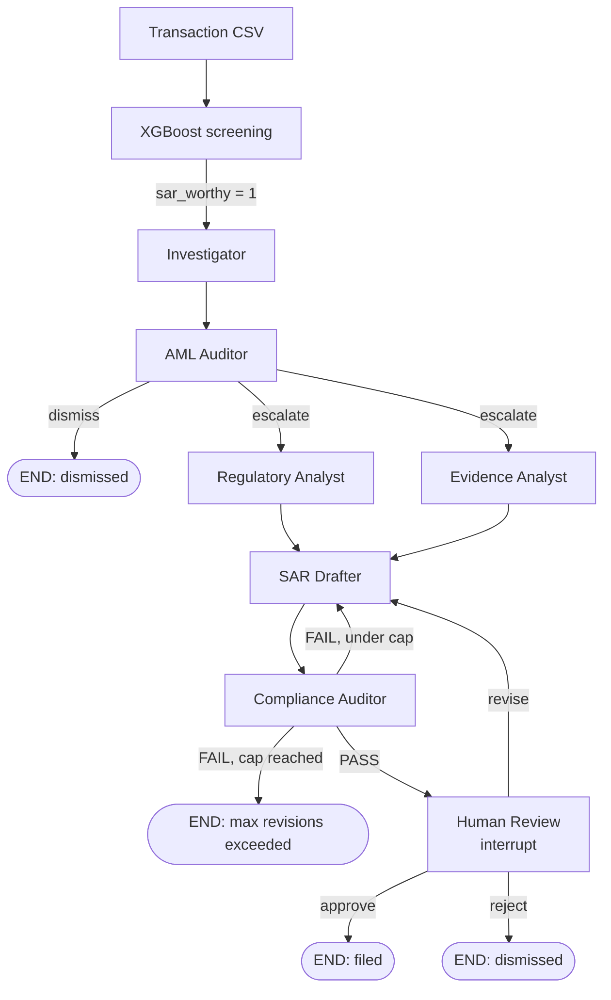

# AML SAR Multi-Agent System

**From raw transactions to a compliance-ready Suspicious Activity Report, with an auditable agent trail and a human in the loop.**

An end-to-end anti-money-laundering pipeline: an XGBoost model screens transactions for suspicious activity, and a [LangGraph](https://langchain-ai.github.io/langgraph/) multi-agent workflow investigates each flagged case, gathers regulatory context, drafts a FinCEN-style SAR, validates it against the evidence, and pauses for a compliance officer's sign-off before anything is "filed".


---

## Table of Contents

- [Why this exists](#why-this-exists)
- [How it works](#how-it-works)
- [The agents](#the-agents)
- [Design principles](#design-principles)
- [Project structure](#project-structure)
- [Getting started](#getting-started)
- [Running the system](#running-the-system)
- [API reference](#api-reference)
- [The XGBoost screening model](#the-xgboost-screening-model)
- [Configuration](#configuration)
- [Known limitations](#known-limitations)
- [Roadmap](#roadmap)
- [Disclaimer](#disclaimer)

---

## Why this exists

Transaction-monitoring models are deliberately noisy. To catch ~90% of genuinely suspicious activity in a dataset where only ~0.1% of transactions are positive, a classifier has to accept a large number of false alarms. Compliance teams then drown in alerts, and every real SAR still takes hours of manual investigation and writing.

This project splits the problem the way real compliance operations do:

| Stage | Job | Tool |
|---|---|---|
| **Recall net** | Catch nearly everything that might be suspicious | XGBoost |
| **Precision work** | Investigate each alert, dismiss weak ones, build evidence for strong ones | LLM agents |
| **Drafting** | Write the SAR narrative and structured fields | LLM agent, grounded in evidence |
| **Assurance** | Verify completeness and that nothing is fabricated | Deterministic checks + LLM auditor |
| **Accountability** | A human approves, rejects, or sends back for revision | LangGraph `interrupt()` |

---

## How it works



A few things worth noticing:

- **Two levels of parallelism.** Regulatory Analyst and Evidence Analyst run in parallel *inside* a case; multiple cases also run concurrently across the batch (bounded by a semaphore to respect API rate limits).
- **One drafting node, two modes.** SAR Drafter handles both the first draft and every revision. Which mode runs is decided purely from state (was the last compliance check a FAIL?), so both automated FAILs and human "revise" decisions flow through the same code path.
- **Every path terminates.** Dismissal, filing, human rejection, and revision-cap exhaustion are all explicit terminal statuses; no case can loop forever or silently vanish.

---

## The agents

| Agent | Objective | Tools |
|---|---|---|
| **Investigator** | Turn the raw alert and engineered features into a structured case brief: what is anomalous, and why | None (works from the alert payload) |
| **AML Auditor** | Match the case against known laundering typologies and make the **escalate / dismiss** call | Embedded FATF/FinCEN typology reference |
| **Regulatory Analyst** | Threshold triggers, sanctions/PEP exposure, jurisdiction risk | OpenSanctions `/match`, Tavily live search |
| **Evidence Analyst** | Consolidate everything into atomic, individually sourced claims | None (pure consolidation) |
| **SAR Drafter** | Write the FinCEN-structured narrative + all Part I–IV fields, and handle revisions | FinCEN SAR template, Tavily advisory search |
| **Compliance Auditor** | Validate field completeness and check every narrative claim against the evidence | Deterministic schema check + LLM groundedness review |
| **Human Review** | Compliance officer approves, rejects, or requests revision | LangGraph `interrupt()` |

### Deterministic where it matters

Sanctions hits, PEP status, and reporting-threshold triggers are computed by **plain code and API responses, never by LLM judgment**. The Regulatory Analyst's LLM only writes the explanatory notes *around* those results. Likewise, the Compliance Auditor's field-completeness check is a mechanical presence check against the same FinCEN template the drafter uses, so the two can never drift apart.

---

## Design principles

1. **Grounded drafting.** SAR Drafter sees only the vetted `evidence_summary` and `regulatory_findings`, never the raw alert. Every fact in the report must trace back through a sourced claim.
2. **A hallucination firewall on a legal document.** The Compliance Auditor compares each narrative sentence against both allowed sources and flags anything unsupported, including fabricated recommendations or action items.
3. **Honest gaps over invented detail.** Missing subject data is written as `Unknown` (FinCEN's own convention), and an honest "not established" counts as addressing a narrative element rather than failing it.
4. **Full audit trail.** Every agent appends a `TraceEntry` (input, output, metadata, timestamp, duration) to shared state via a reducer, so the complete handoff history survives to the end of the run and is served by the API.
5. **Fail loud, not silent.** A failed sanctions screen or a skipped lookup returns an explicit `skipped_reason`; it is never indistinguishable from a clean result.
6. **Bounded loops.** The FAIL ↔ revision cycle is capped, with a distinct terminal status for manual follow-up.
7. **One place to swap LLM providers.** Every agent gets its model from `llm_config.py`, with built-in exponential-backoff retry on rate-limit errors.

---

## Project structure

> Adjust import paths if your layout differs; the structure below reflects how the pieces are organized conceptually.

```
.
├── api.py                      # FastAPI backend: screening, case runs, review actions, PDF export
├── app.py                      # Streamlit frontend
├── main.py                     # CLI batch runner (all flagged transactions, concurrent)
├── llm_config.py               # Single source of truth for the LLM backend + retry logic
├── requirements.txt
├── data/
│   └── screening_results.csv   # XGBoost output consumed by main.py
├── notebooks/
│   └── xgboost.ipynb           # Model training / evaluation
└── graph/
    ├── sar_workflow_state.py   # Typed state, TraceEntry, reducers
    ├── sar_workflow_graph.py   # StateGraph wiring, routing, revision cap
    ├── investigator_agent.py
    ├── aml_auditor_agent.py
    ├── regulatory_analyst_agent.py
    ├── evidence_analyst_agent.py
    ├── sar_drafter_agent.py
    ├── compliance_auditor_agent.py
    └── human_review_agent.py
```

---

## Getting started

### Prerequisites

- **Python 3.11 or 3.12** (recommended; on 3.14 you will see a LangChain/Pydantic V1 compatibility warning)
- API keys (all have free tiers):
  - [Groq](https://console.groq.com): LLM inference
  - [Tavily](https://tavily.com): live web search
  - [OpenSanctions](https://www.opensanctions.org/api/): sanctions/PEP screening

### Install

```bash
git clone <your-repo-url>
cd <your-repo>

python -m venv .venv
# macOS / Linux
source .venv/bin/activate
# Windows
.venv\Scripts\activate

pip install -r requirements.txt
```

The API, frontend, and PDF export also need a few packages that may not be in `requirements.txt` yet:

```bash
pip install fastapi uvicorn python-multipart streamlit reportlab
```

### Environment variables

Create a `.env` file (or export these in your shell):

```bash
GROQ_API_KEY=your_groq_key
TAVILY_API_KEY=your_tavily_key
OPENSANCTIONS_API_KEY=your_opensanctions_key

# Optional
SAR_LLM_MODEL=llama-3.3-70b-versatile
```

Tavily and OpenSanctions degrade gracefully: if a key is missing the corresponding tool returns an explicit "skipped" result rather than crashing the case.

---

## Running the system

### Option 1: Full stack (API + UI)

```bash
# Terminal 1: backend
uvicorn api:app --host 127.0.0.1 --port 8000 --reload

# Terminal 2: frontend
streamlit run app.py
```

Then in the UI:

1. **Screening & Cases**: upload a transaction CSV and run XGBoost screening.
2. Select the suspicious cases you want investigated and click **Run Multi-Agent Analysis**.
3. **Case Reports**: read the SAR, review the compliance result, and **Approve / Reject / Request Revision**.
4. **Agent Execution Trace**: inspect every agent's input, output, and timing.

### Option 2: CLI batch

```bash
python main.py
```

Loads every `sar_worthy == 1` row from `data/screening_results.csv`, runs them concurrently (default 3 at a time), and prints per-case outcomes. Cases that reach human review are reported as `awaiting_human_review` and can be resumed via the API.

### Expected input CSV

The screening endpoint expects these columns:

`Time, Date, Sender_account, Receiver_account, Amount, Payment_currency, Received_currency, Sender_bank_location, Receiver_bank_location, Payment_type`

(The SAML-D synthetic AML dataset schema.)

---

## API reference

| Method | Endpoint | Description |
|---|---|---|
| `GET` | `/health` | Liveness check |
| `POST` | `/screen` | Upload a CSV, score it with XGBoost, return per-transaction results |
| `GET` | `/screening/{id}` | Retrieve a stored screening result |
| `GET` | `/screening/{id}/csv` | Download the scored results as CSV |
| `POST` | `/cases/run` | Run selected suspicious transactions through the SAR workflow |
| `GET` | `/cases` | List all cases and their current status |
| `GET` | `/cases/{transaction_id}` | Full case report (findings, evidence, SAR, compliance check) |
| `GET` | `/cases/{transaction_id}/trace` | The ordered agent execution trace |
| `GET` | `/cases/{transaction_id}/pdf` | Download the SAR as a PDF |
| `POST` | `/cases/{transaction_id}/approve` | Human decision: approve for filing |
| `POST` | `/cases/{transaction_id}/reject` | Human decision: reject (`{"reason": "..."}`) |
| `POST` | `/cases/{transaction_id}/revise` | Human decision: send back for revision (`{"reason": "..."}`) |

Interactive docs are available at `http://127.0.0.1:8000/docs` once the server is running.

### Case statuses

`in_progress` · `awaiting_human_review` · `filed` · `dismissed` · `max_revisions_exceeded` · `error`

---

## The XGBoost screening model

The screening step is trained on the SAML-D synthetic AML dataset, where roughly **0.1%** of transactions are laundering cases. Getting it to hit ~90% recall without collapsing precision required several deliberate choices (see `notebooks/xgboost.ipynb`):

- **Never subsample the positive class.** If the dataset must be reduced, only the negatives are downsampled; every positive case is kept.
- **Imbalance-aware training** via a tuned `scale_pos_weight`, instead of naive resampling that distorts the decision boundary.
- **PR-AUC (`average_precision`) as the tuning metric**, not ROC-AUC, which is misleadingly optimistic at this imbalance.
- **Threshold chosen from the precision-recall curve**, picking the highest-precision operating point that still clears the recall target.
- **Behavioral features**, not just per-row fields: sender/receiver transaction frequency, deviation from the sender's own average, cross-border flag, round-amount flag, and a "near reporting threshold" structuring signal.
- **Native categorical support** (`enable_categorical=True`, `tree_method="hist"`) instead of one-hot encoding, which avoids memory blow-ups on millions of rows. At inference, category codes are rebuilt from the mappings saved at training time so they match exactly.

---

## Configuration

| Setting | Where | Default | Notes |
|---|---|---|---|
| LLM model | `SAR_LLM_MODEL` env var / `llm_config.py` | `llama-3.3-70b-versatile` | Any Groq model with reliable structured output |
| Max revisions | `MAX_REVISIONS` in the graph module | `3` | Shared by automated FAILs and human "revise" |
| Concurrent cases | `MAX_CONCURRENT_CASES` in `main.py` | `3` | Tune to your tightest API rate limit |
| Rate-limit retries | `llm_config.invoke_with_retry` | 5 attempts, exponential backoff | Only retries rate-limit errors |
| Frontend request timeout | `REQUEST_TIMEOUT` in `app.py` | `30` | See note below |

> **Heads up:** `/cases/run` executes the whole agent pipeline before responding, which can take longer than 30 seconds per case. If the UI shows a timeout, the backend is very likely still working. Raise the timeout for that call, or move to a background-task + polling pattern.

### Swapping LLM providers

Providers are chosen in exactly one place. Edit `get_llm()` in `llm_config.py`; no agent file needs to change. Choose a model with proven structured-output / tool-calling support, since not every hosted model accepts the constrained-decoding parameters LangChain sends.

---

## Known limitations

Being upfront about what this is and is not:

- **State is in memory.** The graph uses `MemorySaver`, so cases and human-review checkpoints are lost on restart. Use a persistent checkpointer (SQLite/Postgres) for anything real.
- **Behavioral features are batch-local at inference.** Sender/receiver aggregates are computed only over the uploaded CSV, not a persistent transaction history, which can create train/serve skew on small batches. A real deployment needs a historical store.
- **Sanctions and PEP screening need names.** The current transaction schema carries account IDs and bank locations, not counterparty names. OpenSanctions screening is wired and ready but only activates when `sender_name` / `receiver_name` are supplied; until then it is explicitly skipped, not treated as a clean result. The static jurisdiction lists are fallbacks only.
- **Synthetic data.** The model is trained on a synthetic dataset; performance on real institutional data will differ.
- **Synchronous case runs.** `/cases/run` blocks until the pipeline completes.
- **LLM variability.** Smaller free-tier models follow strict formatting less reliably than frontier models; the schema-enforced fields and the Compliance Auditor exist to contain this, but occasional revision cycles are expected.
- **No real filing.** "Filed" is a status in this system. Nothing is transmitted to FinCEN.

---

## Roadmap

- [ ] Background execution for `/cases/run` with frontend polling
- [ ] Persistent checkpointer (SQLite/Postgres) so reviews survive restarts
- [ ] Point-in-time rolling account features backed by a transaction store
- [ ] Counterparty name capture to activate OpenSanctions screening
- [ ] Wrap `_screen_dataframe` in a thread offload so scoring never blocks the event loop
- [ ] Batch review queue UI for compliance officers
- [ ] Evaluation harness: groundedness and completeness metrics across many cases
- [ ] Authentication and role-based access on the API

---

## Disclaimer

This is an engineering and research project. It is **not** legal or compliance advice, it is not certified for regulatory use, and it does not file anything with FinCEN or any authority. SAR determinations carry legal weight and must be made by qualified compliance professionals; this system is designed to assist them, which is why a human decision gate sits before every "filing".
